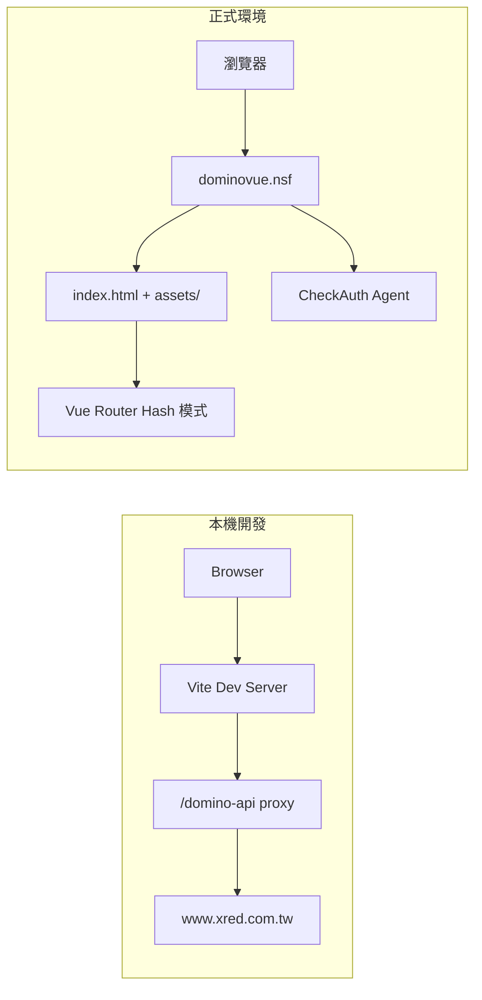

# 將 Vue 部署至 HCL Domino NSF

本文件說明如何把 Vite + Vue 3 前端打包後，部署到 Domino NSF 資料庫，並整合 Domino ACL 登入驗證。

> 本專案範例：`dominovue.nsf`  
> 正式網址：`https://www.xred.com.tw/testleon/dominovue.nsf/index.html`

---

## 為什麼 Domino 部署需要特別設定？

Domino 與一般 Nginx / Apache 靜態主機不同，直接套用 Vue 預設設定會遇到以下問題：

| 問題 | 原因 | 本專案解法 |
|------|------|------------|
| JS/CSS 404 | 資源路徑未含 NSF 路徑 | Vite `base` 設為 `/testleon/dominovue.nsf/` |
| 上傳後載入 `/src/main.js` | 誤上傳開發版 `index.html` | 只上傳 `dist/` 打包結果 |
| `/game` 直接開啟 404 | Domino 把路徑當成設計元素查詢 | Vue Router 改用 **Hash 模式**（`#/game`） |
| 本機開發 CORS 錯誤 | `localhost` 跨域請求 Domino | Vite proxy 轉發 `/domino-api` |
| 換頁時 Session 失效 | 需確認使用者仍登入 | 路由守衛呼叫 `CheckAuth` Agent |

---

## 整體架構



---

## 部署流程總覽

```
1. Domino Designer 建立 NSF 與 CheckAuth Agent
2. 修改 routes.config.js 的 APP_BASE
3. npm run build 產生 dist/
4. 上傳 dist/ 全部檔案至 NSF（File Resource）
5. 瀏覽器開啟 index.html 驗證
```

---

## 第一步：Domino 端準備

### 1. 建立 NSF 資料庫

在 Domino Designer 建立 Web 應用資料庫，例如 `dominovue.nsf`，放置於：

```
/testleon/dominovue.nsf/
```

### 2. 設定 ACL

- 預設使用者需登入才能存取
- 匿名者（`-Default-`）依需求設定；若整個應用需登入，匿名者應無讀取權限
- `assets/` 下的 JS、CSS 若被 ACL 擋住，瀏覽器載入時會跳出登入頁

### 3. 建立 CheckAuth Agent

建立名為 `CheckAuth` 的 Agent（LotusScript 或 Java），供前端驗證 Session。

**重點設定：**

- Agent 名稱必須是 `CheckAuth`（對應 `CheckAuth?OpenAgent`）
- ACL 中匿名者**不可**執行此 Agent（確保未登入時回 401）
- 已登入時回傳 JSON：

```json
{ "status": "OK", "message": "Authenticated" }
```

Agent 需設定 `Content-Type: application/json`。

### 4. 上傳靜態檔案（File Resource）

在 Designer 中，將打包後的檔案匯入為 **File Resource**：

```
dominovue.nsf/
├── index.html          ← 應用入口
├── favicon.ico
└── assets/
    ├── index-xxxxx.js
    ├── index-xxxxx.css
    └── ...（各頁面的 js / css）
```

> **注意：** 請上傳 `dist/` 內的檔案，**不要**上傳專案根目錄的 `index.html`（那是開發版，會引用 `/src/main.js`）。

---

## 第二步：Vue 專案設定

所有部署相關路徑集中在 `src/router/routes.config.js`：

```js
export const APP_BASE = '/testleon/dominovue.nsf/'
```

此路徑會同步套用到：

| 檔案 | 用途 |
|------|------|
| `vite.config.js` → `base` | 打包後靜態資源前綴 |
| `src/router/index.js` → `createWebHashHistory` | Hash 路由 base |
| `src/api/domino.js` → `CHECK_AUTH_PATH` | CheckAuth 請求路徑 |

若 NSF 路徑變更，**只需修改 `APP_BASE` 一處**，再重新 `npm run build`。

### Vite base 路徑

`vite.config.js`：

```js
base: APP_BASE,  // '/testleon/dominovue.nsf/'
```

打包後 `dist/index.html` 的資源路徑會是：

```html
<script src="/testleon/dominovue.nsf/assets/index-xxxxx.js"></script>
<link href="/testleon/dominovue.nsf/assets/index-xxxxx.css">
```

**不要用相對路徑 `base: './'`**，否則從 `/testleon/` 開啟時，瀏覽器會錯誤解析成：

```
https://www.xred.com.tw/testleon/assets/index-xxxxx.js  ❌
```

正確應為：

```
https://www.xred.com.tw/testleon/dominovue.nsf/assets/index-xxxxx.js  ✓
```

### Hash 路由（必要）

Domino **不支援** SPA 的 History 模式。直接開啟：

```
https://www.xred.com.tw/testleon/dominovue.nsf/game
```

Domino 會把 `game` 當成 NSF 設計元素查詢，回傳：

```
HTTP Web Server: 找不到設計註解 - game
```

因此本專案使用 Vue Router 的 **Hash 模式**：

```js
createWebHashHistory(APP_BASE)
```

`#` 後面的路徑不會送到伺服器，由瀏覽器端的 Vue Router 處理。

**正確網址格式：**

| 頁面 | 網址 |
|------|------|
| 首頁 | `.../dominovue.nsf/index.html#/` |
| 遊戲 | `.../dominovue.nsf/index.html#/game` |
| 規則 | `.../dominovue.nsf/index.html#/rules` |

應用內點選單時，`RouterLink` 會自動帶上 `#`，重新整理也不會 404。

---

## 第三步：本機建置

```bash
npm install
npm run build
```

建置完成後，`dist/` 內容如下：

```
dist/
├── index.html
├── favicon.ico
└── assets/
    ├── index-CuDnmmuq.js
    ├── index-CV1ayH2w.css
    └── ...
```

確認 `dist/index.html` 內的 script 路徑含有 `/testleon/dominovue.nsf/assets/`，再進行上傳。

---

## 第四步：上傳至 Domino

1. 執行 `npm run build`
2. 開啟 Domino Designer → `dominovue.nsf`
3. 若曾上傳錯誤的開發版 `index.html`，先刪除
4. 將 `dist/` **所有檔案**匯入為 File Resource，保留目錄結構（`assets/` 子目錄）
5. 檔名含 hash（如 `index-CuDnmmuq.js`），每次 build 可能不同，建議整批覆蓋上傳

**入口網址：**

```
https://www.xred.com.tw/testleon/dominovue.nsf/index.html
```

---

## ACL 驗證機制

每次換頁前，路由守衛會呼叫 CheckAuth：

```
GET /testleon/dominovue.nsf/CheckAuth?OpenAgent
```

| 回應 | 行為 |
|------|------|
| `{ "status": "OK" }` | 放行換頁 |
| `status` 不是 `"OK"` | 阻擋換頁 |
| HTTP 401 / 網路錯誤 | 阻擋換頁（Session 失效） |

相關程式：

- `src/api/domino.js` — API 請求與回應解析
- `src/router/index.js` — `beforeEach` 路由守衛

---

## 本機開發

```bash
npm run dev
```

開發網址（需帶 base 路徑）：

```
http://localhost:5173/testleon/dominovue.nsf/
http://localhost:5173/testleon/dominovue.nsf/#/game
```

### 開發 vs 正式

| 項目 | `npm run dev` | 部署至 Domino |
|------|---------------|---------------|
| 靜態檔 | Vite 即時編譯 | `dist/` 上傳至 NSF |
| API 請求 | `/domino-api` → Vite proxy → Domino | 同網域相對路徑 |
| CORS | proxy 避開跨域限制 | 同網域，無 CORS 問題 |
| Session | Cookie 可能無法帶到 localhost | 正常運作 |
| 路由 | Hash 模式 `#/game` | 同左 |

`vite.config.js` 的 proxy 設定（僅開發用）：

```js
proxy: {
  '/domino-api': {
    target: 'https://www.xred.com.tw',
    changeOrigin: true,
    rewrite: (path) => path.replace(/^\/domino-api/, ''),
  },
}
```

---

## 常見問題

### 1. 頁面空白，Network 顯示 `/src/main.js` 404

**原因：** 上傳了專案根目錄的開發版 `index.html`，而非 `dist/index.html`。

**解法：** 刪除錯誤檔案，改上傳 `npm run build` 產生的 `dist/`。

### 2. JS 路徑變成 `/testleon/assets/...`（少了 dominovue.nsf）

**原因：** `base` 設成相對路徑 `'./'`。

**解法：** 改為絕對路徑 `'/testleon/dominovue.nsf/'`，重新 build 再上傳。

### 3. 直接開 `/dominovue.nsf/game` 出現 404

**原因：** Domino 不認識 `game` 這個設計元素。

**解法：** 使用 Hash 網址 `index.html#/game`。這是 Domino 上 SPA 的標準做法。

### 4. 開啟 JS 檔案網址出現登入頁

**原因：** Domino ACL 要求驗證才能讀取 File Resource。

**解法：** 先從 `index.html` 登入進入；或依需求調整 `assets/` 的 ACL 讀取權限。

### 5. 本機開發 CheckAuth 回 401

**原因：** Domino Session Cookie 綁在 `www.xred.com.tw`，`localhost` 預設帶不到。

**解法：** 先在瀏覽器登入 Domino 網站；正式部署至同網域後 Session 會正常運作。

---

## 新增頁面

1. 在 `src/router/routes.config.js` 的 `routeDefinitions` 新增一筆
2. 建立 `src/views/XxxView.vue`
3. `npm run build` 後重新上傳 `dist/`

導覽列會自動依 `routeDefinitions` 產生，無需改 `App.vue`。

---

## 專案資訊

- **框架：** Vue 3 + Vite 8 + Vue Router 5
- **Node.js：** `^20.19.0` 或 `>=22.12.0`
- **GitHub：** https://github.com/Leon840113/vue-domino
